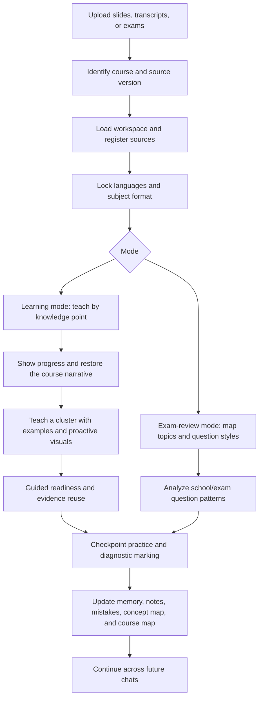

# Course Grounded Tutor V2

Stable AI tutoring for real courses: lecture slides, transcripts, school-provided questions, exam papers, personalized notes, concept maps, progress tracking, and long-term learning memory.

`course-grounded-tutor-v2` is a Codex Skill that turns course materials into a structured tutoring workflow. It is designed for students who want an AI tutor that stays grounded in the course, preserves the teacher's notation, keeps a stable teaching language, remembers weak points across chats, shows current progress, builds clear concept maps, learns school question styles, and creates concise notes for learning and exam review.

## What's New In V2

- Concise concept maps for terminology-heavy courses.
- Highlighted notes with `**Must remember:**`, `**Key idea:**`, `**Exam trigger:**`, and personal warnings.
- Useful figures embedded directly in notes after validation, instead of source-only "see slide" references.
- Current course progress shown directly during tutoring and review, including numeric lesson progress such as `2/10`.
- School question pattern analysis for tutorial sets, sample papers, quizzes, and school-provided practice, recorded mainly for later midterm/final revision.
- Exam-review practice can use original AI questions, school-style imitation, or a mixed set when there is enough evidence or the user explicitly asks.
- Readiness-gated practice prevents a displayed table or brief mention from being mistaken for learned knowledge.
- Adaptive learning clusters prevent content splitting from multiplying quizzes: practice is budgeted as answer actions, and existing evidence is reused.
- Narrative bridges restore the lecturer's transition between topics and clearly separate course core from AI-added support or enrichment.
- Visually dependent topics trigger a validated course figure or labeled AI teaching aid automatically, before the user is asked to interpret it.
- Learning-mode marking is diagnostic without numeric scoring by default; harmless wording is not turned into a weak point.
- Stable subject-format profiles keep mathematics, computing, case-based, evidence-based, and terminology-heavy courses in structures that fit how they are assessed.
- A source register preserves provenance, source versions, processing status, and conflict decisions across chats.

## Why This Exists

General-purpose AI tutoring often drifts:

- It changes language when the user switches languages temporarily.
- It explains with generic notation instead of the course's notation.
- It forgets prior mistakes after context compression or a new chat.
- It summarizes slides but misses the teacher's emphasis from transcripts.
- It gives practice questions that are too easy for exam revision.
- It treats every image as useful, or saves AI-generated diagrams without checking them.
- It does not show the student where they are in the course unless asked.
- It loses the relationship between new terms when a lecture introduces too many names at once.
- It treats information shown in a dense table as if the student can already apply it independently.
- It drops the lecturer's verbal transition, making a valid topic feel unrelated or suddenly introduced.
- It splits a dense topic into smaller points and then assigns a full question set to every split.
- It silently promotes helpful AI-added theory into course-required and tested content.

This skill adds a course-aware teaching protocol so the AI behaves more like a steady tutor working from the same materials a student will be examined on.

## What It Does

- Identifies the course from uploaded materials instead of requiring the user to name it.
- Teaches from PDFs, lecture transcripts, exam papers, sample questions, and existing notes.
- Registers every source and its term/version before relying on it.
- Selects and locks a subject-appropriate teaching structure for the course.
- Locks the reply language and note language until the user explicitly changes them.
- Uses the course's symbols, formulas, terminology, and source priorities.
- Cites relevant slides, transcript ranges, and exam materials in explanations.
- Splits lectures into knowledge points rather than raw page-by-page summaries.
- Restores the course narrative between points by comparing adjacent slides with the matching transcript.
- Separates course core, supporting detail, and enrichment so tutor-added concepts are not silently made examinable.
- Uses a first-exposure teaching gate: explain, demonstrate, run a guided check, then collect 3-5 independent answer actions at a coherent learning-cluster checkpoint.
- Counts question subparts as answer actions, reuses valid evidence, limits immediate remediation, and stops on fatigue.
- Marks user answers, diagnoses misconceptions, and creates targeted follow-up questions.
- Builds personalized study notes and exam-review notes that reflect the user's weak points.
- Builds concise concept maps that show term hierarchy, features, roles, and do-not-confuse warnings.
- Displays current course progress without waiting for the user to ask, including the current knowledge point number and total knowledge points in the current lecture.
- Learns school assessment patterns from school-provided question sets and records them for later midterm/final revision.
- Maintains local memory so future chats can continue without losing context.
- Proactively extracts or generates teaching images for visually dependent reasoning, and uses them only after independent validation checks.

## Core Idea

The skill separates five things that are often mixed together:

| Layer | Purpose | Main files |
| --- | --- | --- |
| Course sources | Original materials | PDFs, transcripts, exams |
| AI memory | Continuity across chats | `memory/learning-state.md`, `memory/weak-points.md` |
| Study notes | Personalized learning notes | `notes/study-notes.md`, `notes/course-map.md`, `notes/concept-map.md` |
| Exam review | Fast recall and exam practice | `notes/exam-review-notes.md`, `exam-review/` |
| School patterns | Local question style memory | `exam-review/school-question-patterns.md` |

The result is not a generic summary of a class. It is a personalized course workspace that records what the student has learned, misunderstood, corrected, and needs to practice next.

## How It Works



## Workspace Layout

The skill uses a project-local workspace by default:

```text
.ai-course-tutor/
  index.md
  courses/
    <course-instance-id>/
      course.yml
      sources/
        slides/
        transcripts/
        exams/
        tutorials/
        assignments/
        readings/
        data/
      extracted/
        pages/
        figures/
      indexes/
        source-register.md
      memory/
        learning-state.md
        session-log.md
        weak-points.md
        practice-history.md
      notes/
        course-map.md
        concept-map.md
        study-notes.md
        exam-review-notes.md
        figure-notes.md
      exam-review/
        exam-topic-map.md
        school-question-patterns.md
```

Keeping the workspace local makes it easier for multiple chats in the same project to share course state without relying on a global database.

## Quick Start

Copy or install this folder as a Codex Skill, then invoke it when working with course materials:

```text
Use $course-grounded-tutor-v2 to teach from these lecture slides and transcript.
```

Install the optional PDF image dependency if you want to extract slide figures:

```bash
pip install -r requirements.txt
```

If a better local tool is needed for a task, the skill should ask for permission to install it rather than silently falling back to a weaker workflow.

Example prompts:

```text
Use $course-grounded-tutor-v2 to identify the course from these uploaded slides, then explain the first knowledge point.
```

```text
Use $course-grounded-tutor-v2 to review this past paper. First map each question to the tested topics, then quiz me in exam style.
```

```text
Use $course-grounded-tutor-v2 to update my notes in Chinese, but keep the teaching language in English.
```

```text
Use $course-grounded-tutor-v2 to analyze these school tutorial questions and learn the school's question style for later revision.
```

## Language Stability

The skill treats language as a contract.

- `reply_language` controls the AI's teaching language.
- `note_language` controls the language used in notes.
- Both are locked after setup.
- Either changes only when the user explicitly asks for a durable change.

This lets a student ask a clarification in their first language without accidentally changing the tutor's long-term teaching language.

## Subject-Appropriate Teaching

The skill selects one stable profile from the course's dominant reasoning task: quantitative-formal, computational-systems, conceptual-case-based, evidence-argument, language-terminology, or a justified mixed profile. The profile remains locked across chats unless the user explicitly changes it or sustained course evidence shows that it is a poor fit.

## Notes That Stay Useful

The note system is intentionally concise. It does not try to preserve every line of chat.

Study notes focus on:

- Knowledge points
- Course definitions
- Formulas using course notation
- Symbol explanations
- Highlighted memory targets and key ideas
- User-specific misunderstandings
- Useful figures embedded directly in the note after validation
- Mistake review

Exam-review notes focus on:

- High-frequency topics
- Complete formula sheet
- Question patterns
- Trigger words
- Marking points
- Recurring exam mistakes

Concept maps focus on:

- Term hierarchy
- Related terms
- Features and roles
- User's own correct wording
- Do-not-confuse warnings

School question pattern notes focus on:

- Tested knowledge points
- Wording signals
- Scenario and data style
- Marking expectations
- Traps and imitation guidance

## Figures And Images

Course figures and AI-generated teaching aids are handled separately.

- Course figures are extracted from official materials.
- AI-generated teaching aids are marked as not from the course source.
- Screenshots should crop the key content, not the whole slide, unless full context matters.
- Graphs, diagnostic plots, diagrams, process flows, interfaces, visual comparisons, and layout-dependent outputs trigger a proactive visual check; the tutor should not wait for the student to ask.
- Notes must embed validated useful figures directly. A source citation alone is not enough for a `Useful Figure` section.
- When a better extraction or OCR tool is missing, the skill should request permission to install it and use it after approval.
- Every image must pass three independent checks before being shown or saved:
  - educational relevance
  - source and content fidelity
  - visual usability

## Included Files

```text
course-grounded-tutor-v2/
  SKILL.md
  README.md
  requirements.txt
  agents/
    openai.yaml
  references/
    assessment-rubric.md
    concept-map-protocol.md
    course-identification.md
    exam-review-protocol.md
    figure-selection-rules.md
    language-contract.md
    learning-pacing-protocol.md
    memory-schema.md
    note-emphasis-protocol.md
    note-taking-protocol.md
    progress-display-protocol.md
    practice-readiness-protocol.md
    school-assessment-patterns.md
    subject-format-profiles.md
    tooling-protocol.md
    tutoring-protocol.md
  assets/
    *.template
  scripts/
    build_course_index.py
    extract_pdf_figures.py
    init_course_workspace.py
    update_learning_state.py
  tests/
    test_scripts.py
```

## Scripts

Initialize a course workspace:

```bash
python scripts/init_course_workspace.py --course-id stat5002-2026-s1
```

Rebuild the course index:

```bash
python scripts/build_course_index.py
```

Update the current snapshot and durable memory records:

```bash
python scripts/update_learning_state.py \
  --course-dir .ai-course-tutor/courses/stat5002-2026-s1 \
  --mode learning \
  --topic "Sampling distribution" \
  --current-lesson "Week 3" \
  --lesson-progress "2/10" \
  --learning-cluster "Sampling variability and standard error" \
  --narrative-bridge "Sample variability motivates the sampling distribution" \
  --instruction-stage guided_checked \
  --practice-gate independent_ready \
  --practice-checkpoint "2/4 answer actions evidenced" \
  --required-concepts "Standard deviation; sample mean" \
  --source-layers "course core" \
  --answer-actions 2 \
  --sources "Week 3 slides p. 12" \
  --taught "Definition and standard error notation" \
  --user-performance "Confused SD and SE" \
  --weak-point "Standard error vs standard deviation" \
  --follow-up "Ask one applied SE question"
```

Render selected PDF pages or crops as images:

```bash
python scripts/extract_pdf_figures.py \
  --pdf week03-slides.pdf \
  --out .ai-course-tutor/courses/stat5002-2026-s1/extracted/figures \
  --pages 12 \
  --rect 72,120,540,620 \
  --name sampling-distribution
```

`extract_pdf_figures.py` requires PyMuPDF, which is listed in `requirements.txt`. It refuses to overwrite an existing crop unless `--overwrite` is given.

## Design Principles

- Course sources beat generic explanations.
- Slides define notation; transcripts reveal teaching emphasis; exams reveal assessment style.
- Adjacent slides and transcript passages define the course narrative; terse source jumps receive a minimal labeled bridge instead of unexplained new terminology.
- Source identity, term, and provenance are recorded before material is reused across chats.
- Teaching structure should fit the subject and remain stable within the course.
- Stable language is more important than mirroring the user's temporary language.
- Notes should be personalized and concise.
- Notes should visually mark key points and required memorization without becoming noisy.
- Concept maps should keep terminology relationships clear.
- Current progress should be visible during tutoring and review.
- Progress should include the current lecture's numeric knowledge-point count, such as `2/10`, once the lesson is segmented.
- School-provided questions should inform later school-style practice, not interrupt ordinary concept learning with style-choice prompts.
- Good tools should be used when they improve reliability; missing tools should trigger an installation request, not a silent downgrade.
- Practice should respond to the user's actual mistakes.
- First-exposure practice belongs to coherent learning checkpoints, not every content split. Every requested subpart counts toward the workload.
- Ordinary learning feedback is diagnostic without numeric scores by default; harmless expression issues receive an inline correction only.
- Displayed information is not treated as learned. Independent practice starts only after required concepts are explained, demonstrated when needed, and checked with the user.
- If the tutor asks an inadequately taught question, the item is withdrawn from scoring and recorded as a tutor coverage gap, not a student weakness.
- Uncertain decisions should be offered as clear choices instead of guessed.
- Images must be useful, faithful, readable, and clearly labeled.

Run the bundled script tests with:

```bash
python -m unittest discover -s tests -v
```

## Limitations

- This skill is a tutoring workflow, not a replacement for the course instructor.
- Video and audio are best used after conversion into transcript text or selected frames.
- Image extraction depends on local PDF tooling and image quality.
- Course materials may have copyright restrictions; decide what you publish or share.

## License

MIT License.
