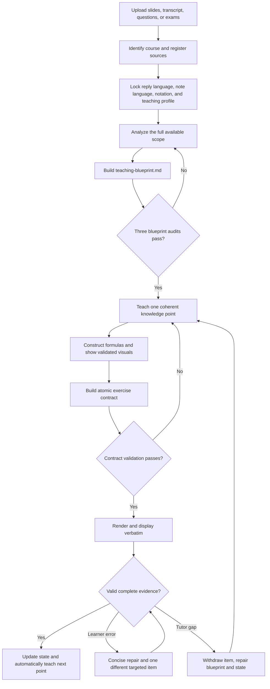

# Course Grounded Tutor V3.2.3

[](../LICENSE)
[](#installation)
[](https://www.python.org/)

A course-grounded AI tutoring workflow for lecture slides, teacher transcripts, school questions, exam papers, datasets, personalized notes, and learning memory.

V3.2.3 makes new figure storage predictable and prevents mirror hashes from claiming a sync that did not copy the tracked file.

## What's New In V3.2.3

- Uses `extracted/figures/` as the default location for new central-note figures while permitting note-local `assets/` or `figures/` for linked weekly notes.
- Preserves existing validated image paths instead of moving files merely to normalize directory names.
- Defines mirror blueprint and learning-state hashes as tracked-file snapshots; a hash may change only after that exact file is copied and verified.

## What's New In V3.2.2

- Reports `canonical_workspace_inside_skill_distribution` as a non-blocking structural warning.
- Keeps relocation separate from ordinary note maintenance and requires isolated migration with fingerprint comparison.
- Prevents cross-project note links from being used as a shortcut around a misplaced canonical workspace.

## What's New In V3.2.1

- Audits the central study-note index and its explicitly linked local Markdown note surfaces as one learner-facing set.
- Resolves figure delivery, formula inventory, personal-warning lifecycle, and freshness across that complete set.
- Reports broken or out-of-project detailed-note links without scanning unrelated Markdown files.

## What's New In V3.2.0

- **Note-health audit:** workspace audits report template-only exam notes, formula-inventory gaps, study-note structure drift, note lag, and warning-lifecycle gaps without blocking teaching.
- **Bidirectional figure delivery:** audits compare study-note images with the figure register, detect broken links, and distinguish embedded, pending, reference-only, and archived figures.
- **Course-map authority:** `notes/course-map.md` is explicitly canonical; weekly companion maps must declare that they are derived views.
- **Evidence-safe exam inventory:** ordinary learning may add course formulas and must-remember items to exam notes, but must label exam frequency unknown until school assessment evidence exists.

V3.1.3 closed the remaining cross-workspace creation gap in the V3.1.2 single-writer design and added a Windows-safe full teaching-cycle regression.

## What's New In V3.1.3

- **Scoped initialization:** creating a new canonical requires known external workspace roots or an explicit confirmation that no canonical is known.
- **Cross-root duplicate detection:** one audit command can inspect several workspace roots and invalidates every duplicate canonical course ID.
- **Full-cycle regression:** tests now cover blueprint promotion, contract promotion, learner rendering, state write, and automatic advancement in one sequence.
- **Windows-safe state replacement:** Windows paths in contracts and evidence are inserted as literal text rather than regular-expression replacement syntax.

## What's New In V3.1.2

- **One canonical writer:** each course instance has one `canonical` workspace allowed to store teaching evidence.
- **Read-only mirrors:** a `reference_mirror` routes discovery to its absolute canonical path and cannot promote blueprints, promote exercise contracts, or update learning state.
- **Drift visibility:** mirror metadata records the canonical blueprint and learning-state hashes observed at the last sync; audit warnings reveal later drift without making the mirror teachable.
- **Safe joint audits:** mirrors are reported separately from `ready` courses and do not make a healthy workspace audit fail.

## What's New In V3.1.1

- **No self-declared readiness:** formal teaching, including ordinary non-advancing explanations, reopens and validates the actual blueprint.
- **Draft promotion:** blueprint and exercise-contract validators promote valid drafts atomically and can return text or JSON reports.
- **Safe legacy migration:** a sidecar V3.1 draft is repaired and promoted before activation; the old blueprint receives a timestamped backup.
- **Workspace audit states:** `ready`, `reference_mirror`, `migration_required`, and `invalid` distinguish formal teaching, read-only routing, migration, and contradictions.
- **Strict state JSON:** unknown fields and mixed input modes are rejected; dry-run and printable schema modes are available.
- **Nested YAML correctness:** course indexing reads full YAML paths, so repeated keys such as `status` and `version` no longer collide.
- **Publish safety:** a distributable check rejects private course workspaces, caches, course-material files, personal paths, and broken routed references.

## What's New In V3.1

- **Immutable exercise contracts:** the exact learner-facing question and its rubric are validated before display.
- **Atomic action counting:** every classification, reason, calculation, explanation, owner, timing choice, indicator, and outcome counts separately. Nested demands cannot masquerade as one question.
- **Teaching-evidence binding:** every answer action is authorized by a stable blueprint Point ID and points to an explicit explanation and a worked demonstration of the same reasoning operation.
- **Question-rubric symmetry:** the marker cannot add requirements that were absent from the question or never demonstrated.
- **Deterministic rendering:** validated contract data is rendered by a script and shown verbatim, preventing last-moment prompt drift.
- **Hard state enforcement:** `coverage-gate passed` is rejected without a valid contract matching the point, source fingerprint, and exercise-set ID.

## Why V3

AI tutoring often fails even when the right materials were uploaded:

- The transcript is registered but the explanation still follows compressed slide headings.
- A formula appears before its objects and operations have meaning.
- Easy recognition questions are treated as proof of full understanding.
- The tutor asks a warm-up check and then another practice set for the same content.
- Correct answers are followed by repeated “continue?” prompts.
- Lesson totals, notes, and mastery records drift after a topic is split.
- A stronger model repairs mistakes, but the next chat or lower reasoning setting repeats them.

V3 turns these failure modes into explicit gates backed by a durable, validated plan.

## What's New In V3

- **Whole-scope teaching blueprint:** analyzes all currently supplied lessons before detailed teaching and records the coherent learning order.
- **Transcript evidence gate:** stores the lecturer's transition and explanation sequence for every point, not only a transcript citation.
- **Formula construction gate:** requires objects, fixed/varying roles, relationships, operations, transformations, units, and normalization before the complete formula is used.
- **One exercise set per point:** removes the guided-check plus independent-practice duplication.
- **Meaningful difficulty:** exercises must use taught content but cannot simply copy the worked example with different numbers.
- **Automatic advancement:** after a valid answer with no unresolved issue, the tutor begins the next point without asking permission again.
- **Evidence-level mastery:** “continue”, “okay”, and one shallow recognition answer cannot promote an entire point.
- **Index consistency gate:** blueprint, source register, course map, progress denominator, and learning state must agree.
- **Failure escalation:** repeated tutor coverage gaps trigger a complete audit of the remaining lesson instead of endless local patching.
- **Model continuity:** new chats and different models load the same validated plan and exact unresolved relationships.

V3 retains V2's stable language contracts, course notation, proactive validated figures, personalized notes, concept maps, visible numeric progress, exam review, and school assessment-pattern memory.

## Core Workflow



## Four Hard Gates

| Gate | What must be true |
| --- | --- |
| Transcript evidence | A usable passage locator, teacher transition, explanation order, and emphasis are recorded, or the absence of a transcript is explicit. |
| Formula construction | Every required object, symbol, relation, operator, transformation, fixed/varying role, unit, and normalization step is taught and demonstrated. |
| Exercise contract and mastery | Every atomic action has explanation and demonstration evidence, one explicit prompt, and one matching criterion; the answer then supplies the claimed relationship evidence. |
| Index consistency | The blueprint, source set, point order, course map, progress denominator, and current state agree. |

Detailed teaching or progress advancement stops when a relevant gate fails.

## Teaching Behavior

Each learning-mode knowledge point follows one stable cycle:

1. Numeric progress and objective.
2. Transcript-grounded connection to the previous point.
3. Definitions, relationships, and course notation.
4. Proactive validated visual when the reasoning is visual.
5. Formula construction and a complete worked example when required.
6. One validated exercise contract, normally three atomic answer actions, rendered verbatim.
7. Diagnostic marking and automatic advancement after a valid answer.

The tutor does not add a second readiness quiz, repeat the worked example as homework, or ask whether to continue after successful completion.

## Stable Language And Notation

- The first user message sets the default reply language.
- If the first message contains only course material, the material language becomes the default.
- Reply language changes only after an explicit request.
- Note language defaults to the reply language and also changes only explicitly.
- Temporary questions in another language do not change either contract.
- Formulas and symbols follow current course materials, with every symbol and operation explained professionally.

## Workspace

The skill keeps course data in the project workspace, outside the distributable skill folder:

```text
.ai-course-tutor/
  index.md
  courses/
    <course-instance-id>/
      course.yml
      sources/
        slides/
        transcripts/
        exams/
        tutorials/
        assignments/
        readings/
        data/
      extracted/
        pages/
        figures/
      indexes/
        source-register.md
        teaching-blueprint.md
      memory/
        exercise-contracts/
        learning-state.md
        session-log.md
        weak-points.md
        practice-history.md
      notes/
        course-map.md
        concept-map.md
        study-notes.md
        exam-review-notes.md
        figure-notes.md
      exam-review/
        exam-topic-map.md
        school-question-patterns.md
```

`indexes/teaching-blueprint.md` preserves teaching quality. `memory/learning-state.md` stores current execution. `notes/course-map.md` remains the learner-facing concept locator.

Each course instance must have exactly one writable `canonical` workspace. A duplicate kept for discovery or recovery is marked `reference_mirror`; its index entry points to `canonical_course_dir`, and the bundled validators reject durable teaching writes in the mirror.

## Blueprint Preflight

Before the first detailed explanation, V3.1:

1. Inspects all currently supplied slides, matching transcript passages, assessments, and existing learning evidence.
2. Segments transcripts into usable semantic passages even when timestamps or line numbers are coarse.
3. Designs the dependency order and restores lecturer transitions.
4. Plans terminology, formula operations, visuals, worked examples, exercise coverage, and likely load risks for every point.
5. Runs separate source-fidelity, dependency-order, and novice-assessment audits.
6. Validates the completed file with the bundled script.

When only part of the course is available, the blueprint covers that full available scope and marks future material unavailable instead of inventing it.

## Exercises And Marking

- Default: three meaningful answer actions after each coherent point.
- Use four or five only when the point has several distinct examinable operations.
- Every requested output is an atomic action; top-level numbering does not hide subparts.
- Every action must bind to one eligible blueprint relationship, explanation locator, worked-example locator, and rubric criterion.
- Integrated questions require a complete worked demonstration of the integration structure, not only prior teaching of component frameworks.
- The final question is rendered from an immutable JSON contract and displayed without additions.
- Questions may be scaffolded, but they must require reasoning rather than copying.
- No new concept may be hidden inside a question or marking criterion.
- Learning-mode feedback is diagnostic and normally unscored.
- Exam-review marking is strict and source-matched.
- A genuine error receives one concise repair and one different targeted item.
- A tutor coverage gap is withdrawn and never recorded as a learner weakness.

## Figures And Notes

- Visually dependent teaching triggers a course figure or clearly labeled AI teaching aid without waiting for the user to ask.
- Every image must pass three independent checks for educational relevance, source/content fidelity, and visual usability.
- Source screenshots are cropped to effective content.
- Useful figures are embedded directly in notes; a “see slide” pointer is incomplete.
- Study notes remain concise but include all course content, with important material emphasized and formulas complete.
- Personalized warnings preserve the user's corrected mental model, not tutor-created errors.
- Terminology-heavy topics receive concise relationship maps after teaching.

## Exam Review And School Style

Past papers, sample exams, mock exams, marking rubrics, and exam-style requests activate exam-review behavior. The tutor maps topics, wording, scenarios, operations, answer structure, marks, and traps before review.

Ordinary tutorials and workshop sheets are recorded as provisional school-style evidence. They do not interrupt normal learning with style-selection prompts. During midterm or final review, the user may choose original AI questions, school-style imitation, or a mixed set when evidence is sufficient.

## Installation

Install or link the folder using your agent platform's skill mechanism, or load `SKILL.md` as project instructions. `agents/openai.yaml` is an optional OpenAI/Codex interface adapter; other platforms can ignore it.

The deterministic gates require an agent that can read and write local files and run Python 3.10 or newer. Without command execution, the prose workflow still provides guidance, but draft promotion, workspace auditing, contract validation, and state enforcement are not guaranteed.

For cross-platform compatibility, the frontmatter intentionally stays minimal: `name`, `description`, `license`, and `metadata`. Environment requirements remain in this README and the skill body because current agent-platform validators do not consistently accept the wider optional frontmatter defined by the shared specification.

Example explicit invocation on platforms that support `$skill-name`:

```text
Use $course-grounded-tutor-v3 to teach from these course materials.
```

Install the optional PDF figure dependency:

```bash
pip install -r requirements.txt
```

The skill asks permission before installing a missing tool that materially improves extraction, OCR, visualization, or note processing.

## Scripts

Initialize a course workspace:

```bash
python scripts/init_course_workspace.py \
  --course-id example-course-2026-s1 \
  --known-workspace /path/to/another/.ai-course-tutor
```

When no external workspace or registry exists, use `--confirm-no-known-canonical` only after checking the available course indexes. `--force` never bypasses an existing canonical conflict.

Validate a completed teaching blueprint and its progress denominator:

```bash
python scripts/validate_teaching_blueprint.py \
  --blueprint .ai-course-tutor/courses/example-course-2026-s1/indexes/teaching-blueprint.md \
  --progress 2/10 --promote --report text
```

Audit a course before formal teaching:

```bash
python scripts/audit_course_workspace.py \
  --course-dir .ai-course-tutor/courses/example-course-2026-s1
```

Audit several workspace roots before creating a duplicate or when course discovery finds more than one location:

```bash
python scripts/audit_course_workspace.py \
  --workspace /project-a/.ai-course-tutor \
  --workspace /project-b/.ai-course-tutor
```

Validate and render an exercise before showing it:

```bash
python scripts/validate_exercise_contract.py \
  --contract .ai-course-tutor/courses/example-course-2026-s1/memory/exercise-contracts/week03-point02.json \
  --blueprint .ai-course-tutor/courses/example-course-2026-s1/indexes/teaching-blueprint.md \
  --progress 2/10 --promote --report text

python scripts/render_exercise_contract.py \
  --contract .ai-course-tutor/courses/example-course-2026-s1/memory/exercise-contracts/week03-point02.json \
  --blueprint .ai-course-tutor/courses/example-course-2026-s1/indexes/teaching-blueprint.md \
  --progress 2/10
```

Update state through the recommended exclusive JSON interface:

```bash
python scripts/update_learning_state.py --print-schema
python scripts/update_learning_state.py \
  --state-json state-update.json --dry-run
python scripts/update_learning_state.py \
  --state-json state-update.json
```

Use `assets/state-update.json.template` as the starting shape. The existing CLI flag interface remains available for compatibility.

Check the folder before publishing:

```bash
python scripts/check_distributable.py --skill-dir .
```

Run tests:

```bash
python -m unittest discover -s tests -v
```

## V2 And V3 Migration

V3.1.1 preserves existing course materials, personalized notes, and valid learner evidence. It does not treat a legacy workspace as ready until the workspace schema, blueprint, and current state agree.

```bash
python scripts/migrate_blueprint_v3_to_v31.py create-draft \
  --course-dir .ai-course-tutor/courses/example-course-2026-s1 \
  --lesson-id week-03

python scripts/validate_teaching_blueprint.py \
  --blueprint .ai-course-tutor/courses/example-course-2026-s1/indexes/teaching-blueprint.v31-draft.md \
  --promote --report text

python scripts/migrate_blueprint_v3_to_v31.py activate \
  --course-dir .ai-course-tutor/courses/example-course-2026-s1
```

While migration is incomplete, the tutor may answer an explicitly requested local clarification but cannot continue formal teaching, issue exercises, score answers, record mastery, or advance progress.

Legacy `sources.md`, handwritten learning state, and old course metadata use a separate conservative migration chain:

```bash
python scripts/migrate_legacy_workspace.py plan \
  --course-dir .ai-course-tutor/courses/example-course-2026-s1

python scripts/migrate_legacy_workspace.py create-draft \
  --course-dir .ai-course-tutor/courses/example-course-2026-s1 \
  --safe-point-id week-03-p02 \
  --current-lesson week-03

python scripts/migrate_legacy_workspace.py validate-draft \
  --course-dir .ai-course-tutor/courses/example-course-2026-s1

python scripts/migrate_legacy_workspace.py activate \
  --course-dir .ai-course-tutor/courses/example-course-2026-s1 \
  --dry-run

python scripts/migrate_legacy_workspace.py activate \
  --course-dir .ai-course-tutor/courses/example-course-2026-s1
```

The source index and legacy managed snapshot are preserved verbatim, active originals receive timestamped backups, and activation is blocked if any original changed after draft creation. The selected recovery point always starts as `not_started`; historical `practiced` or `mastered` text remains visible history but is not converted into V3.1 evidence.

Legacy `introduced` and `guided` states are incomplete. A legacy `practiced` state is retained only when its recorded exercise evidence satisfies the V3.1 gates. This prevents old shallow checks or self-declared coverage from carrying false mastery into the new workflow.

## Privacy

The repository contains only the reusable skill. Course PDFs, transcripts, notes, datasets, extracted figures, and learning history belong in the project-local `.ai-course-tutor` workspace and should not be committed with the skill.

## Limitations

- The blueprint can cover only materials currently supplied.
- Script validation proves structural consistency, stable bindings, and file/hash agreement. It does not independently prove that the agent interpreted a PDF, transcript, figure, or lecturer statement correctly; source-fidelity audits must reopen the cited material.
- Video and audio are most reliable after transcription and selected-frame extraction.
- Figure quality depends on source quality and available local tools.
- The workflow improves consistency but does not replace course staff or official marking guidance.

## License

MIT License.
