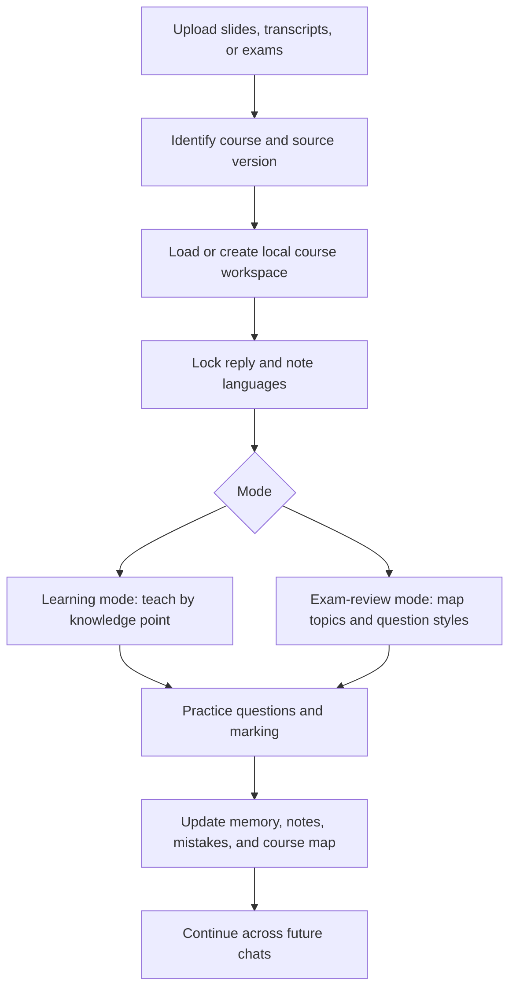

# Course Grounded Tutor

Stable AI tutoring for real courses: lecture slides, transcripts, exam papers, personalized notes, and long-term learning memory.

`course-grounded-tutor` is a Codex Skill that turns course materials into a structured tutoring workflow. It is designed for students who want an AI tutor that stays grounded in the course, preserves the teacher's notation, keeps a stable teaching language, remembers weak points across chats, and creates concise notes for learning and exam review.

## Why This Exists

General-purpose AI tutoring often drifts:

- It changes language when the user switches languages temporarily.
- It explains with generic notation instead of the course's notation.
- It forgets prior mistakes after context compression or a new chat.
- It summarizes slides but misses the teacher's emphasis from transcripts.
- It gives practice questions that are too easy for exam revision.
- It treats every image as useful, or saves AI-generated diagrams without checking them.

This skill adds a course-aware teaching protocol so the AI behaves more like a steady tutor working from the same materials a student will be examined on.

## What It Does

- Identifies the course from uploaded materials instead of requiring the user to name it.
- Teaches from PDFs, lecture transcripts, exam papers, sample questions, and existing notes.
- Locks the reply language and note language until the user explicitly changes them.
- Uses the course's symbols, formulas, terminology, and source priorities.
- Cites relevant slides, transcript ranges, and exam materials in explanations.
- Splits lectures into knowledge points rather than raw page-by-page summaries.
- Generates 3-5 practice questions after each knowledge point.
- Marks user answers, diagnoses misconceptions, and creates targeted follow-up questions.
- Builds personalized study notes and exam-review notes that reflect the user's weak points.
- Maintains local memory so future chats can continue without losing context.
- Extracts or generates teaching images only after independent validation checks.

## Core Idea

The skill separates four things that are often mixed together:

| Layer | Purpose | Main files |
| --- | --- | --- |
| Course sources | Original materials | PDFs, transcripts, exams |
| AI memory | Continuity across chats | `memory/learning-state.md`, `memory/weak-points.md` |
| Study notes | Personalized learning notes | `notes/study-notes.md`, `notes/course-map.md` |
| Exam review | Fast recall and exam practice | `notes/exam-review-notes.md`, `exam-review/` |

The result is not a generic summary of a class. It is a personalized course workspace that records what the student has learned, misunderstood, corrected, and needs to practice next.

## How It Works



## Workspace Layout

The skill uses a project-local workspace by default:

```text
.ai-course-tutor/
  index.md
  courses/
    <course-instance-id>/
      course.yml
      sources/
        slides/
        transcripts/
        exams/
      extracted/
        pages/
        figures/
      indexes/
      memory/
        learning-state.md
        session-log.md
        weak-points.md
        practice-history.md
      notes/
        course-map.md
        study-notes.md
        exam-review-notes.md
        figure-notes.md
      exam-review/
```

Keeping the workspace local makes it easier for multiple chats in the same project to share course state without relying on a global database.

## Quick Start

Copy or install this folder as a Codex Skill, then invoke it when working with course materials:

```text
Use $course-grounded-tutor to teach from these lecture slides and transcript.
```

Example prompts:

```text
Use $course-grounded-tutor to identify the course from these uploaded slides, then explain the first knowledge point.
```

```text
Use $course-grounded-tutor to review this past paper. First map each question to the tested topics, then quiz me in exam style.
```

```text
Use $course-grounded-tutor to update my notes in Chinese, but keep the teaching language in English.
```

## Language Stability

The skill treats language as a contract.

- `reply_language` controls the AI's teaching language.
- `note_language` controls the language used in notes.
- Both are locked after setup.
- Either changes only when the user explicitly asks for a durable change.

This lets a student ask a clarification in their first language without accidentally changing the tutor's long-term teaching language.

## Notes That Stay Useful

The note system is intentionally concise. It does not try to preserve every line of chat.

Study notes focus on:

- Knowledge points
- Course definitions
- Formulas using course notation
- Symbol explanations
- User-specific misunderstandings
- Useful figures
- Mistake review

Exam-review notes focus on:

- High-frequency topics
- Complete formula sheet
- Question patterns
- Trigger words
- Marking points
- Recurring exam mistakes

## Figures And Images

Course figures and AI-generated teaching aids are handled separately.

- Course figures are extracted from official materials.
- AI-generated teaching aids are marked as not from the course source.
- Screenshots should crop the key content, not the whole slide, unless full context matters.
- Every image must pass three independent checks before being shown or saved:
  - educational relevance
  - source and content fidelity
  - visual usability

## Included Files

```text
course-grounded-tutor/
  SKILL.md
  agents/
    openai.yaml
  references/
    assessment-rubric.md
    course-identification.md
    exam-review-protocol.md
    figure-selection-rules.md
    language-contract.md
    memory-schema.md
    note-taking-protocol.md
    tutoring-protocol.md
  assets/
    *.template
  scripts/
    build_course_index.py
    extract_pdf_figures.py
    init_course_workspace.py
    update_learning_state.py
```

## Scripts

Initialize a course workspace:

```bash
python scripts/init_course_workspace.py --course-id stat5002-2026-s1
```

Rebuild the course index:

```bash
python scripts/build_course_index.py
```

Append a compact memory update:

```bash
python scripts/update_learning_state.py \
  --course-dir .ai-course-tutor/courses/stat5002-2026-s1 \
  --mode learning \
  --topic "Sampling distribution" \
  --sources "Week 3 slides p. 12" \
  --taught "Definition and standard error notation" \
  --user-performance "Confused SD and SE" \
  --weak-point "Standard error vs standard deviation" \
  --follow-up "Ask one applied SE question"
```

Render selected PDF pages or crops as images:

```bash
python scripts/extract_pdf_figures.py \
  --pdf week03-slides.pdf \
  --out .ai-course-tutor/courses/stat5002-2026-s1/extracted/figures \
  --pages 12
```

`extract_pdf_figures.py` requires PyMuPDF.

## Design Principles

- Course sources beat generic explanations.
- Slides define notation; transcripts reveal teaching emphasis; exams reveal assessment style.
- Stable language is more important than mirroring the user's temporary language.
- Notes should be personalized and concise.
- Practice should respond to the user's actual mistakes.
- Uncertain decisions should be offered as clear choices instead of guessed.
- Images must be useful, faithful, readable, and clearly labeled.

## Limitations

- This skill is a tutoring workflow, not a replacement for the course instructor.
- Video and audio are best used after conversion into transcript text or selected frames.
- Image extraction depends on local PDF tooling and image quality.
- Course materials may have copyright restrictions; decide what you publish or share.

## License

Add a license before publishing this repository publicly.
